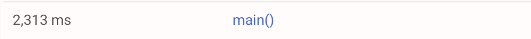

# MRE_opencensus_pubsub

This minimal reproducible example compares how [GCP's PubSub Go client library](https://godoc.org/cloud.google.com/go/pubsub) and [GoCDK](https://github.com/google/go-cloud) interact with [OpenCensus](https://opencensus.io/introduction/).

Both examples can be ran locally with:
- `GCP_PROJECT=your-gcp-project TOPIC=your-topic go run officialgcp/main.go`
- `GCP_PROJECT=your-gcp-project TOPIC=your-topic go run gocdk/main.go`

Provided:
- You have enabled the [Stackdriver Trace API](https://cloud.google.com/trace/docs/reference/) on your GCP project.
- [Application Default Credentials](https://cloud.google.com/docs/authentication/production) can be found on your machine.

## Results as of the 21/03/19

### With GCP's PubSub Go client library

The PubSub publish span is exported into its own trace, as described in [this issue](https://github.com/googleapis/google-cloud-go/issues/1347)

### With Go Cloud Development Kit

The PubSub publish span is nested into the main trace as one could expect.

